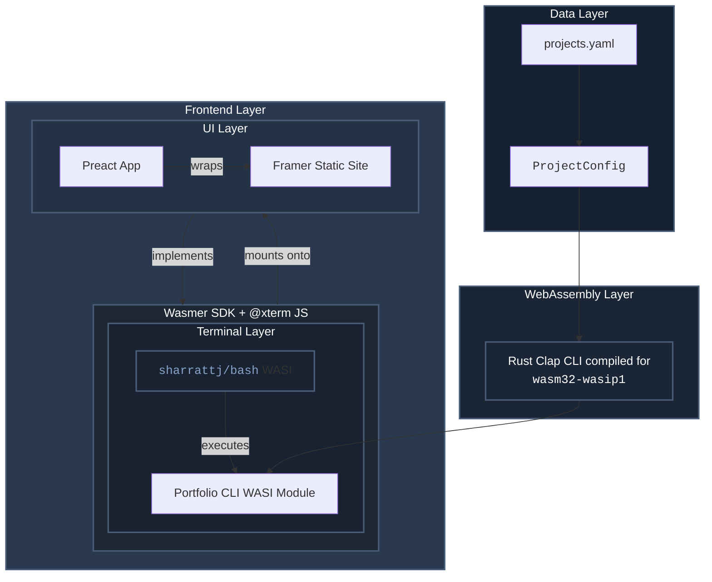

# Wasmer-Hosted Rust CLI - Portfolio Website

A unique portfolio website that showcases a Rust CLI application running directly in the browser. Built using Clap, in Rust, compiled for a WASI target, and executed by the `sharrattj/bash` x-term WASI module. This project demonstrates how to bring native CLI experiences to the web.

## 🚀 Features
- Interactive CLI interface in the browser
- Native Rust Clap CLI compiled for browser execution
- Command-line style navigation through portfolio sections
- Modern, minimalist web integration with Preact

## 🛠️ Tech Stack

- **CLI**:
  - Rust
  - [clap](https://github.com/clap-rs/clap) for CLI argument parsing
  - WASI target compilation
  
- **Web Integration**:
  - Preact to wrap the generated Framer html
  - Wasmer SDK used as the WASM host.
  - `sharrattj/bash` x-term module which executes the CLI binary

I run format and Clippy checks before each commit using the shell script at `/project-cli/scripts/check.sh`/

Here is a diagram showing the architecture of the app:

